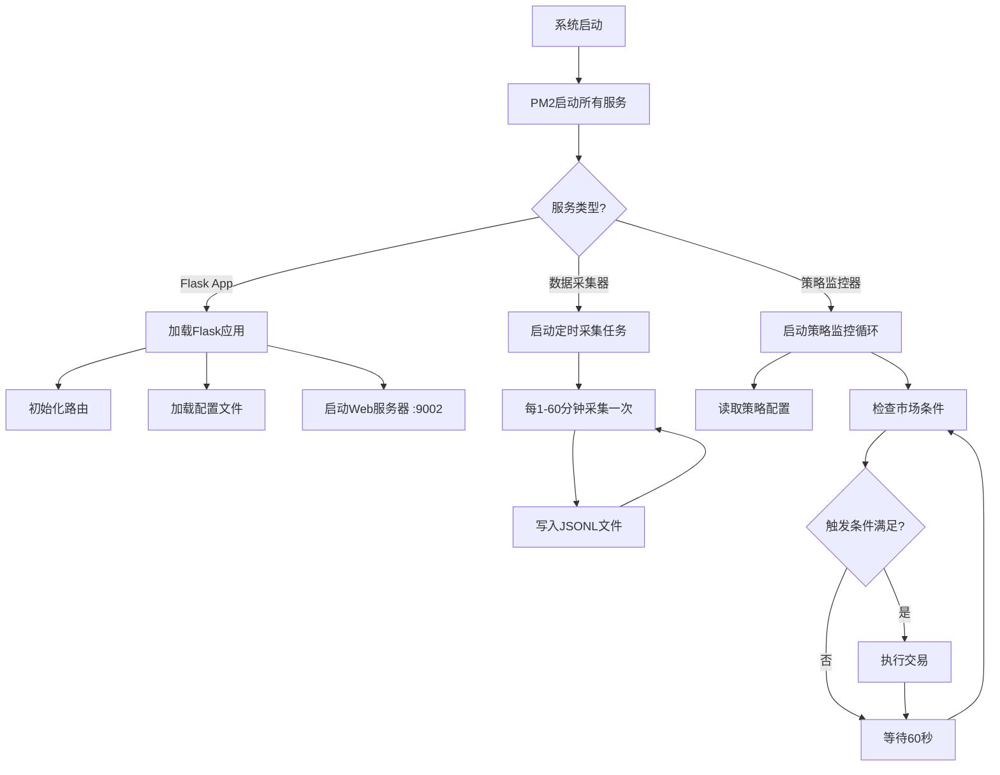

# OKX交易系统完整技术文档 v2.7.0

**文档版本**: 2.7.0  
**更新时间**: 2026-02-21  
**系统版本**: 6a7bc9c21df61b283df71b9f7fc3f20555907262

---

## 📋 目录

1. [系统概述](#系统概述)
2. [系统架构](#系统架构)
3. [运行逻辑与流程](#运行逻辑与流程)
4. [JSONL数据格式详解](#jsonl数据格式详解)
5. [功能模块详解](#功能模块详解)
6. [PM2服务管理](#pm2服务管理)
7. [API路由文档](#api路由文档)
8. [依赖包清单](#依赖包清单)
9. [环境变量配置](#环境变量配置)
10. [数据目录结构](#数据目录结构)
11. [部署与维护](#部署与维护)

---

## 系统概述

### 1.1 系统定位

OKX交易系统是一个**自动化加密货币交易系统**，基于技术指标和市场情绪分析，实现以下核心功能：
- **自动开仓**: 根据见顶/见底信号自动做空/做多
- **智能止盈止损**: 动态监控持仓，自动执行止盈止损
- **多账户管理**: 支持4个OKX账户独立策略配置
- **风险控制**: 仓位管理、单币限额、冷却期机制
- **实时监控**: 市场数据实时采集、Telegram通知

### 1.2 技术栈

**后端技术**:
- Python 3.10+ (Flask 3.1.2)
- CCXT 4.5.38 (交易所API)
- APScheduler 3.11.2 (定时任务)
- pandas 2.2.3 (数据处理)

**前端技术**:
- HTML5 + CSS3 + JavaScript (原生)
- Chart.js / Plotly (数据可视化)
- Bootstrap 5 (UI框架)

**进程管理**:
- PM2 (Node.js进程管理器)
- 27个独立监控服务

**数据存储**:
- JSONL格式 (时序数据)
- JSON格式 (配置文件)

---

## 系统架构

### 2.1 整体架构图

```
┌─────────────────────────────────────────────────────────────┐
│                      用户层 (Browser)                         │
│  ┌────────────┐  ┌────────────┐  ┌────────────┐            │
│  │ OKX交易页面 │  │ 币种追踪页 │  │ 实时监控页 │            │
│  └────────────┘  └────────────┘  └────────────┘            │
└────────────────────────────┬────────────────────────────────┘
                             │ HTTP/HTTPS
                             ▼
┌─────────────────────────────────────────────────────────────┐
│                    应用层 (Flask App)                         │
│  ┌──────────────────────────────────────────────────────┐   │
│  │ app.py (主应用)                                       │   │
│  │ - 200+ API路由                                        │   │
│  │ - 策略配置管理                                         │   │
│  │ - 交易执行逻辑                                         │   │
│  │ - 数据查询接口                                         │   │
│  └──────────────────────────────────────────────────────┘   │
└────────────────────────────┬────────────────────────────────┘
                             │
                             ▼
┌─────────────────────────────────────────────────────────────┐
│               业务逻辑层 (Python Services)                    │
│  ┌────────────────┐  ┌────────────────┐                    │
│  │ 见顶信号做空策略│  │ 见底信号做多策略│                    │
│  │ top_signal_*.py│  │ bottom_signal_*│                    │
│  └────────────────┘  └────────────────┘                    │
│  ┌────────────────┐  ┌────────────────┐                    │
│  │ 止盈止损监控    │  │ RSI开仓策略    │                    │
│  │ okx-tpsl-*     │  │ rsi-takeprofit-*│                    │
│  └────────────────┘  └────────────────┘                    │
└────────────────────────────┬────────────────────────────────┘
                             │
                             ▼
┌─────────────────────────────────────────────────────────────┐
│              数据采集层 (Collectors - 20+ Services)          │
│  ┌─────────────┐ ┌─────────────┐ ┌─────────────┐          │
│  │ signal-     │ │ market-     │ │ price-      │          │
│  │ collector   │ │ sentiment   │ │ position    │          │
│  │ (信号采集)   │ │ (市场情绪)  │ │ (价格位置)  │          │
│  └─────────────┘ └─────────────┘ └─────────────┘          │
│  ┌─────────────┐ ┌─────────────┐ ┌─────────────┐          │
│  │ liquidation │ │ sar-slope   │ │ new-high-low│          │
│  │ (清算数据)   │ │ (SAR斜率)  │ │ (新高新低)  │          │
│  └─────────────┘ └─────────────┘ └─────────────┘          │
└────────────────────────────┬────────────────────────────────┘
                             │
                             ▼
┌─────────────────────────────────────────────────────────────┐
│                  数据存储层 (JSONL/JSON Files)                │
│  ┌──────────────────────────────────────────────────────┐   │
│  │ data/                                                │   │
│  │ ├── okx_auto_strategy/      (策略执行记录)           │   │
│  │ ├── okx_bottom_signal_*/    (见底信号配置/执行)      │   │
│  │ ├── market_sentiment/       (市场情绪数据)           │   │
│  │ ├── signals/                (信号数据)               │   │
│  │ ├── okx_trading_history/    (交易历史)               │   │
│  │ └── [60+ 其他数据目录]                               │   │
│  └──────────────────────────────────────────────────────┘   │
└────────────────────────────┬────────────────────────────────┘
                             │
                             ▼
┌─────────────────────────────────────────────────────────────┐
│                   外部API层 (Third-Party APIs)                │
│  ┌───────────────┐  ┌───────────────┐  ┌──────────────┐   │
│  │ OKX Exchange  │  │ Binance API   │  │ Telegram Bot │   │
│  │ (交易执行)     │  │ (价格数据)     │  │ (消息通知)    │   │
│  └───────────────┘  └───────────────┘  └──────────────┘   │
└─────────────────────────────────────────────────────────────┘
```

### 2.2 核心组件关系

```
Flask App (app.py)
    ├── 策略管理模块
    │   ├── 见顶信号做空策略 (top_signal_*)
    │   ├── 见底信号做多策略 (bottom_signal_*)
    │   ├── RSI自动开仓策略 (rsi_*)
    │   └── 上涨占比0策略 (upratio0_*)
    │
    ├── 监控模块
    │   ├── 止盈止损监控 (okx-tpsl-monitor)
    │   ├── RSI止盈监控 (rsi-takeprofit-monitor)
    │   ├── 见底信号监控 (bottom-signal-long-monitor)
    │   └── 数据健康监控 (data-health-monitor)
    │
    ├── 数据采集模块
    │   ├── 市场信号采集 (signal-collector)
    │   ├── 市场情绪采集 (market-sentiment-collector)
    │   ├── 价格数据采集 (price-*-collector)
    │   ├── 清算数据采集 (liquidation-*-collector)
    │   └── 技术指标采集 (sar-*, crypto-index-collector)
    │
    ├── 数据处理模块
    │   ├── 信号统计 (signal-stats-generator)
    │   ├── SAR偏差统计 (sar-bias-stats-collector)
    │   ├── 币种追踪 (coin-change-tracker)
    │   └── 交易历史 (okx-trade-history)
    │
    └── API服务模块
        ├── 交易API (200+ routes)
        ├── 数据查询API
        ├── 配置管理API
        └── 监控统计API
```

---

## 运行逻辑与流程

### 3.1 系统启动流程



### 3.2 见顶信号做空策略流程

```
┌─────────────────────────────────────────────────────────────┐
│ 1. 用户在前端开启"见顶信号+涨幅前8做空"开关                   │
└───────────────────────────┬─────────────────────────────────┘
                            ▼
┌─────────────────────────────────────────────────────────────┐
│ 2. JavaScript发送POST请求:                                   │
│    /api/okx-trading/set-allowed-top-signal/account_main/    │
│    top8_short                                                │
│    Body: {allowed: true, reason: "开启监控", rsiValue: 1800} │
└───────────────────────────┬─────────────────────────────────┘
                            ▼
┌─────────────────────────────────────────────────────────────┐
│ 3. Flask后端接收请求:                                        │
│    - 验证账户ID和策略类型                                     │
│    - 创建/更新执行许可JSONL文件                               │
│    - 文件路径: data/okx_auto_strategy/                       │
│      account_main_top_signal_top8_short_execution.jsonl     │
│    - 写入数据: {                                             │
│        "timestamp": "2026-02-21T13:00:00.000000",           │
│        "account_id": "account_main",                        │
│        "strategy_type": "top8_short",                       │
│        "allowed": true,                                     │
│        "reason": "开启见顶信号+涨幅前8做空监控，RSI阈值1800", │
│        "rsi_value": 1800,                                   │
│        "sentiment": "见顶信号"                               │
│      }                                                       │
└───────────────────────────┬─────────────────────────────────┘
                            ▼
┌─────────────────────────────────────────────────────────────┐
│ 4. 后端监控脚本 (source_code/top_signal_monitor.py)          │
│    每60秒执行一次循环:                                        │
│    ┌──────────────────────────────────────────────────┐     │
│    │ 4.1 读取执行许可文件                              │     │
│    │     - 检查第一行JSON数据                          │     │
│    │     - if allowed == false: 跳过本次检查           │     │
│    │     - if allowed == true: 继续执行                │     │
│    └──────────────────────────────────────────────────┘     │
│    ┌──────────────────────────────────────────────────┐     │
│    │ 4.2 检查冷却期                                    │     │
│    │     - 读取最后一条执行记录的时间戳                 │     │
│    │     - if 距离上次执行 < 1小时: 跳过               │     │
│    │     - if 距离上次执行 >= 1小时: 继续              │     │
│    └──────────────────────────────────────────────────┘     │
│    ┌──────────────────────────────────────────────────┐     │
│    │ 4.3 获取市场数据                                  │     │
│    │     - 读取最新市场情绪数据                        │     │
│    │       data/market_sentiment/market_sentiment.jsonl│     │
│    │     - 检查是否包含 "⚠️见顶信号"                  │     │
│    │     - 获取常用币涨跌幅列表                        │     │
│    │     - 计算RSI总和                                 │     │
│    └──────────────────────────────────────────────────┘     │
│    ┌──────────────────────────────────────────────────┐     │
│    │ 4.4 判断触发条件                                  │     │
│    │     if (见顶信号存在 AND RSI总和 > 1800):         │     │
│    │         - 满足开仓条件                            │     │
│    │     else:                                         │     │
│    │         - 不满足，等待下次检查                     │     │
│    └──────────────────────────────────────────────────┘     │
│    ┌──────────────────────────────────────────────────┐     │
│    │ 4.5 准备开仓                                      │     │
│    │     - 获取账户可用余额 (USDT)                     │     │
│    │     - 计算总开仓金额 = 可用余额 × 1.5%            │     │
│    │     - 选择涨幅前8名币种                           │     │
│    │     - 每个币种分配金额 = 总金额 / 8               │     │
│    │     - 限制单币最大 5 USDT                         │     │
│    └──────────────────────────────────────────────────┘     │
│    ┌──────────────────────────────────────────────────┐     │
│    │ 4.6 执行开仓                                      │     │
│    │     for coin in top8_coins:                      │     │
│    │         - 通过CCXT调用OKX API                     │     │
│    │         - ccxt.create_market_sell_order()        │     │
│    │         - 参数:                                   │     │
│    │           * symbol: coin/USDT:USDT (永续合约)    │     │
│    │           * amount: 计算的币数量                  │     │
│    │           * leverage: 10倍                       │     │
│    │         - 记录开仓结果                            │     │
│    └──────────────────────────────────────────────────┘     │
│    ┌──────────────────────────────────────────────────┐     │
│    │ 4.7 记录执行日志                                  │     │
│    │     - 追加执行记录到JSONL文件                     │     │
│    │     - {                                          │     │
│    │         "timestamp": "2026-02-21T13:05:00",     │     │
│    │         "account_id": "account_main",           │     │
│    │         "allowed": false,  // 自动设为false      │     │
│    │         "reason": "执行见顶信号做空，等待1小时",  │     │
│    │         "coins": ["BTC", "ETH", ...],           │     │
│    │         "total_amount": 45.50,                  │     │
│    │         "success_count": 8,                     │     │
│    │         "fail_count": 0                         │     │
│    │       }                                          │     │
│    │     - 更新第一行allowed为false（进入冷却期）      │     │
│    └──────────────────────────────────────────────────┘     │
│    ┌──────────────────────────────────────────────────┐     │
│    │ 4.8 发送Telegram通知                             │     │
│    │     - 发送开仓成功通知                            │     │
│    │     - 包含：币种列表、开仓金额、市场情绪、RSI值  │     │
│    └──────────────────────────────────────────────────┘     │
│    ▼                                                         │
│    等待60秒后重新开始循环                                     │
└─────────────────────────────────────────────────────────────┘
```

### 3.3 见底信号做多策略流程

```
┌─────────────────────────────────────────────────────────────┐
│ 1. 用户在前端配置"见底信号+涨幅前8做多"参数                   │
│    - RSI阈值: 800 (可配置 300-1500)                          │
│    - 单币限额: 5 USDT (可配置 1-100 USDT)                    │
│    - 点击"保存配置"按钮                                       │
└───────────────────────────┬─────────────────────────────────┘
                            ▼
┌─────────────────────────────────────────────────────────────┐
│ 2. JavaScript发送POST请求:                                   │
│    /api/okx-trading/save-bottom-signal-config/               │
│    account_main/top8_long                                    │
│    Body: {                                                   │
│      rsi_threshold: 800,                                     │
│      max_order_per_coin: 5                                   │
│    }                                                         │
└───────────────────────────┬─────────────────────────────────┘
                            ▼
┌─────────────────────────────────────────────────────────────┐
│ 3. Flask后端保存配置:                                        │
│    - 创建/更新配置文件                                        │
│    - 文件路径: data/okx_bottom_signal_strategies/           │
│      account_main_bottom_signal_top8_long.jsonl             │
│    - 写入数据: {                                             │
│        "timestamp": "2026-02-21T13:10:00.000000",           │
│        "account_id": "account_main",                        │
│        "strategy_type": "top8_long",                        │
│        "rsi_threshold": 800,                                │
│        "max_order_per_coin": 5,                             │
│        "leverage": 10,                                      │
│        "position_percent": 1.5                              │
│      }                                                       │
└───────────────────────────┬─────────────────────────────────┘
                            ▼
┌─────────────────────────────────────────────────────────────┐
│ 4. 用户开启策略开关                                          │
│    JavaScript发送POST请求:                                   │
│    /api/okx-trading/set-allowed-bottom-signal/               │
│    account_main/top8_long                                    │
│    Body: {allowed: true}                                     │
└───────────────────────────┬─────────────────────────────────┘
                            ▼
┌─────────────────────────────────────────────────────────────┐
│ 5. Flask后端创建/更新执行许可文件:                            │
│    - 文件路径: data/okx_bottom_signal_execution/            │
│      account_main_bottom_signal_top8_long_execution.jsonl   │
│    - 写入数据: {                                             │
│        "timestamp": "2026-02-21T13:11:00.000000",           │
│        "account_id": "account_main",                        │
│        "strategy_type": "top8_long",                        │
│        "allowed": true,                                     │
│        "reason": "开启见底信号+涨幅前8做多监控"              │
│      }                                                       │
└───────────────────────────┬─────────────────────────────────┘
                            ▼
┌─────────────────────────────────────────────────────────────┐
│ 6. 监控脚本 (bottom_signal_long_monitor.py) 每60秒检查:     │
│    ┌──────────────────────────────────────────────────┐     │
│    │ 6.1 读取配置文件和执行许可文件                     │     │
│    │     - 配置: RSI阈值=800, 单币限额=5U              │     │
│    │     - 许可: allowed=true                          │     │
│    └──────────────────────────────────────────────────┘     │
│    ┌──────────────────────────────────────────────────┐     │
│    │ 6.2 检查冷却期 (1小时)                            │     │
│    └──────────────────────────────────────────────────┘     │
│    ┌──────────────────────────────────────────────────┐     │
│    │ 6.3 获取市场数据                                  │     │
│    │     - 市场情绪: 检查 "🎯见底信号"                │     │
│    │     - 常用币涨跌幅列表                            │     │
│    │     - RSI总和计算                                 │     │
│    └──────────────────────────────────────────────────┘     │
│    ┌──────────────────────────────────────────────────┐     │
│    │ 6.4 判断触发条件                                  │     │
│    │     if (见底信号存在 AND RSI总和 < 800):          │     │
│    │         - 满足开多单条件                          │     │
│    │     else:                                         │     │
│    │         - 不满足，等待下次检查                     │     │
│    └──────────────────────────────────────────────────┘     │
│    ┌──────────────────────────────────────────────────┐     │
│    │ 6.5 准备开多单                                    │     │
│    │     - 获取可用余额                                │     │
│    │     - 总金额 = 余额 × 1.5%                        │     │
│    │     - 选择涨幅前8名币种                           │     │
│    │     - 单币金额 = min(总金额/8, 5U)                │     │
│    └──────────────────────────────────────────────────┘     │
│    ┌──────────────────────────────────────────────────┐     │
│    │ 6.6 执行开多单                                    │     │
│    │     for coin in top8_coins:                      │     │
│    │         ccxt.create_market_buy_order(            │     │
│    │             symbol=coin/USDT:USDT,               │     │
│    │             amount=calculated_amount,            │     │
│    │             params={'leverage': 10}              │     │
│    │         )                                        │     │
│    └──────────────────────────────────────────────────┘     │
│    ┌──────────────────────────────────────────────────┐     │
│    │ 6.7 记录执行日志 + Telegram通知                   │     │
│    └──────────────────────────────────────────────────┘     │
│    ▼                                                         │
│    等待60秒后重新开始循环                                     │
└─────────────────────────────────────────────────────────────┘
```

### 3.4 止盈止损监控流程

```
┌─────────────────────────────────────────────────────────────┐
│ okx-tpsl-monitor (止盈止损监控器)                            │
│ 运行频率: 每10秒一次                                         │
│                                                              │
│ ┌──────────────────────────────────────────────────┐        │
│ │ 1. 获取所有账户的持仓数据                         │        │
│ │    for account in [main, fangfang12, anchor,    │        │
│ │                    poit_main]:                   │        │
│ │        positions = okx_api.fetch_positions()    │        │
│ └──────────────────────────────────────────────────┘        │
│ ┌──────────────────────────────────────────────────┐        │
│ │ 2. 读取止盈止损配置                               │        │
│ │    文件: data/okx_tpsl_settings/                 │        │
│ │          account_{account_id}_tpsl_settings.json│        │
│ │    配置项:                                        │        │
│ │    - take_profit_enabled: true/false             │        │
│ │    - take_profit_threshold: 50 USDT (默认)      │        │
│ │    - stop_loss_enabled: true/false               │        │
│ │    - stop_loss_threshold: -30 USDT (默认)       │        │
│ └──────────────────────────────────────────────────┘        │
│ ┌──────────────────────────────────────────────────┐        │
│ │ 3. 遍历所有持仓                                   │        │
│ │    for position in positions:                    │        │
│ │        unrealized_pnl = position['unrealizedPnl']│        │
│ │                                                   │        │
│ │        // 止盈检查                                │        │
│ │        if (take_profit_enabled AND              │        │
│ │            unrealized_pnl >= take_profit_threshold):│      │
│ │            execute_close_position(position)      │        │
│ │            send_telegram("🎉 止盈平仓成功")       │        │
│ │                                                   │        │
│ │        // 止损检查                                │        │
│ │        if (stop_loss_enabled AND                 │        │
│ │            unrealized_pnl <= stop_loss_threshold):│       │
│ │            execute_close_position(position)      │        │
│ │            send_telegram("⚠️ 止损平仓")          │        │
│ └──────────────────────────────────────────────────┘        │
│ ┌──────────────────────────────────────────────────┐        │
│ │ 4. 记录监控日志                                   │        │
│ │    文件: data/okx_tpsl_logs/                     │        │
│ │          {account_id}_tpsl_log_{date}.jsonl     │        │
│ │    记录:                                          │        │
│ │    - 检查时间                                     │        │
│ │    - 持仓数量                                     │        │
│ │    - 触发的止盈止损事件                           │        │
│ │    - 平仓结果                                     │        │
│ └──────────────────────────────────────────────────┘        │
│ ▼                                                            │
│ 等待10秒后重新开始循环                                       │
└─────────────────────────────────────────────────────────────┘
```

---

## JSONL数据格式详解

### 4.1 格式说明

**JSONL (JSON Lines)** 是一种文本格式，每一行都是一个独立的、有效的JSON对象。

**优势**:
- ✅ 时序数据追加写入，无需重写整个文件
- ✅ 大文件处理友好，可按行读取
- ✅ 方便日志记录和数据分析
- ✅ 兼容性好，易于解析

**基本规则**:
```jsonl
{"field1": "value1", "field2": 123}
{"field1": "value2", "field2": 456}
{"field1": "value3", "field2": 789}
```

### 4.2 见顶信号执行许可文件格式

**文件路径**: `data/okx_auto_strategy/account_{account_id}_top_signal_{strategy_type}_execution.jsonl`

**文件说明**: 
- 第一行: 当前策略的执行许可配置（会被动态更新）
- 后续行: 历史执行记录（只追加，不修改）

**第一行数据格式** (执行许可):
```json
{
  "timestamp": "2026-02-21T13:00:00.123456",  // ISO 8601格式时间戳
  "account_id": "account_main",                // 账户ID
  "strategy_type": "top8_short",               // 策略类型: top8_short | bottom8_short
  "allowed": true,                             // 是否允许执行: true=允许, false=冷却中
  "reason": "开启见顶信号+涨幅前8做空监控，RSI阈值1800",  // 操作原因描述
  "rsi_value": 1800,                           // RSI阈值 (可选)
  "sentiment": "见顶信号"                      // 市场情绪标签 (可选)
}
```

**后续行数据格式** (执行记录):
```json
{
  "timestamp": "2026-02-21T13:05:12.456789",  // 执行时间
  "account_id": "account_main",
  "strategy_type": "top8_short",
  "allowed": false,                            // 执行后自动设为false
  "reason": "执行见顶信号做空，涨幅前8名，等待1小时冷却",
  "trigger_conditions": {                      // 触发条件详情
    "has_top_signal": true,
    "rsi_sum": 1850.5,
    "rsi_threshold": 1800,
    "market_sentiment": "极度看跌"
  },
  "execution_details": {                       // 执行详情
    "coins": ["BTC", "ETH", "BNB", "SOL", "XRP", "ADA", "DOGE", "AVAX"],
    "total_available": 3000.00,                // 可用余额 USDT
    "total_used": 45.00,                       // 总开仓金额 (1.5%)
    "per_coin_amount": 5.625,                  // 单币分配金额
    "per_coin_limit": 5.0,                     // 单币限额
    "actual_per_coin": 5.0,                    // 实际单币金额 (取min)
    "leverage": 10,                            // 杠杆倍数
    "success_count": 8,                        // 成功开仓数量
    "fail_count": 0,                           // 失败数量
    "orders": [                                // 订单详情列表
      {
        "coin": "BTC",
        "side": "sell",
        "amount_usd": 5.0,
        "amount_coin": 0.00012,
        "price": 41666.67,
        "order_id": "okx_order_123456789",
        "status": "filled",
        "timestamp": "2026-02-21T13:05:12.567890"
      },
      // ... 其他7个币种的订单
    ]
  },
  "next_allowed_time": "2026-02-21T14:05:12.456789"  // 下次可执行时间
}
```

**字段详解**:

| 字段 | 类型 | 必填 | 说明 |
|------|------|------|------|
| `timestamp` | string | ✅ | ISO 8601格式时间戳 |
| `account_id` | string | ✅ | 账户标识: account_main/fangfang12/anchor/poit_main |
| `strategy_type` | string | ✅ | 策略类型: top8_short/bottom8_short |
| `allowed` | boolean | ✅ | 执行许可标志 |
| `reason` | string | ✅ | 操作原因描述 |
| `rsi_value` | number | ❌ | RSI阈值 (用于判断) |
| `sentiment` | string | ❌ | 市场情绪标签 |
| `trigger_conditions` | object | ❌ | 触发条件详情 (仅执行记录) |
| `execution_details` | object | ❌ | 执行详情 (仅执行记录) |
| `next_allowed_time` | string | ❌ | 下次可执行时间 (仅执行记录) |

**使用示例**:

```python
import json

# 读取执行许可（第一行）
def check_execution_allowed(account_id, strategy_type):
    file_path = f"data/okx_auto_strategy/account_{account_id}_top_signal_{strategy_type}_execution.jsonl"
    try:
        with open(file_path, 'r') as f:
            first_line = f.readline()
            data = json.loads(first_line)
            return data.get('allowed', False)
    except FileNotFoundError:
        return True  # 文件不存在，默认允许执行

# 追加执行记录
def log_execution(account_id, strategy_type, execution_data):
    file_path = f"data/okx_auto_strategy/account_{account_id}_top_signal_{strategy_type}_execution.jsonl"
    with open(file_path, 'a') as f:
        f.write(json.dumps(execution_data, ensure_ascii=False) + '\n')

# 更新执行许可（更新第一行）
def update_execution_permission(account_id, strategy_type, allowed, reason):
    file_path = f"data/okx_auto_strategy/account_{account_id}_top_signal_{strategy_type}_execution.jsonl"
    
    # 读取所有行（除第一行）
    lines = []
    try:
        with open(file_path, 'r') as f:
            lines = f.readlines()[1:]  # 跳过第一行
    except FileNotFoundError:
        pass
    
    # 写入新的第一行 + 保留的旧记录
    with open(file_path, 'w') as f:
        permission_data = {
            "timestamp": datetime.now().isoformat(),
            "account_id": account_id,
            "strategy_type": strategy_type,
            "allowed": allowed,
            "reason": reason
        }
        f.write(json.dumps(permission_data, ensure_ascii=False) + '\n')
        f.writelines(lines)
```

### 4.3 见底信号配置文件格式

**文件路径**: `data/okx_bottom_signal_strategies/account_{account_id}_bottom_signal_{strategy_type}.jsonl`

**文件说明**: 存储见底信号策略的配置参数（RSI阈值、单币限额等）

**数据格式**:
```json
{
  "timestamp": "2026-02-21T13:10:00.123456",  // 配置更新时间
  "account_id": "account_main",
  "strategy_type": "top8_long",               // top8_long | bottom8_long
  "rsi_threshold": 800,                       // RSI阈值: 300-1500
  "max_order_per_coin": 5.0,                  // 单币限额: 1-100 USDT
  "leverage": 10,                             // 杠杆倍数 (固定10倍)
  "position_percent": 1.5,                    // 仓位百分比 (固定1.5%)
  "enabled": true,                            // 配置是否启用
  "updated_by": "web_interface",              // 更新来源
  "version": "1.0"                            // 配置版本号
}
```

**字段详解**:

| 字段 | 类型 | 范围 | 默认值 | 说明 |
|------|------|------|--------|------|
| `rsi_threshold` | number | 300-1500 | 800 | RSI总和阈值，低于此值触发开多单 |
| `max_order_per_coin` | number | 1-100 | 5.0 | 单个币种最大开仓金额(USDT) |
| `leverage` | number | 固定 | 10 | 杠杆倍数 |
| `position_percent` | number | 固定 | 1.5 | 占可用余额的百分比 |

**前端配置流程**:
1. 用户在Web界面修改RSI阈值和单币限额
2. 点击"保存配置"按钮
3. JavaScript发送POST请求到后端API
4. 后端验证参数范围
5. 更新配置文件（追加新行）
6. 监控脚本读取最新配置（读取最后一行）

### 4.4 见底信号执行许可文件格式

**文件路径**: `data/okx_bottom_signal_execution/account_{account_id}_bottom_signal_{strategy_type}_execution.jsonl`

**文件说明**: 
- 第一行: 当前策略的执行许可状态
- 后续行: 历史执行记录

**第一行数据格式** (执行许可):
```json
{
  "timestamp": "2026-02-21T13:11:00.123456",
  "account_id": "account_main",
  "strategy_type": "top8_long",               // top8_long | bottom8_long
  "allowed": true,                            // 是否允许执行
  "reason": "开启见底信号+涨幅前8做多监控"
}
```

**后续行数据格式** (执行记录):
```json
{
  "timestamp": "2026-02-21T13:15:30.456789",
  "account_id": "account_main",
  "strategy_type": "top8_long",
  "allowed": false,                            // 执行后自动设为false
  "reason": "执行见底信号做多，涨幅前8名，等待1小时冷却",
  "trigger_conditions": {
    "has_bottom_signal": true,
    "rsi_sum": 750.3,
    "rsi_threshold": 800,
    "market_sentiment": "底部背离"
  },
  "execution_details": {
    "coins": ["BTC", "ETH", "BNB", "SOL", "XRP", "ADA", "DOGE", "AVAX"],
    "total_available": 2500.00,
    "total_used": 37.50,                       // 2500 * 1.5%
    "per_coin_amount": 4.6875,
    "per_coin_limit": 5.0,
    "actual_per_coin": 4.6875,
    "leverage": 10,
    "success_count": 8,
    "fail_count": 0,
    "orders": [
      {
        "coin": "BTC",
        "side": "buy",                         // 做多用buy
        "amount_usd": 4.6875,
        "amount_coin": 0.000112,
        "price": 41964.29,
        "order_id": "okx_order_987654321",
        "status": "filled",
        "timestamp": "2026-02-21T13:15:30.567890"
      },
      // ... 其他7个币种
    ]
  },
  "next_allowed_time": "2026-02-21T14:15:30.456789"
}
```

### 4.5 止盈止损配置文件格式

**文件路径**: `data/okx_tpsl_settings/account_{account_id}_tpsl_settings.json`

**文件说明**: 存储账户的止盈止损配置（JSON格式，不是JSONL）

**数据格式**:
```json
{
  "account_id": "account_main",
  "take_profit": {
    "enabled": true,                           // 是否启用止盈
    "threshold": 50.0,                         // 止盈阈值 (USDT)
    "notify": true                             // 是否发送Telegram通知
  },
  "stop_loss": {
    "enabled": true,                           // 是否启用止损
    "threshold": -30.0,                        // 止损阈值 (USDT，负数)
    "notify": true
  },
  "rsi_take_profit": {
    "enabled": false,                          // RSI止盈是否启用
    "rsi_threshold": 200.0,                    // RSI阈值
    "profit_threshold": 10.0                   // 盈利阈值 (USDT)
  },
  "updated_at": "2026-02-21T13:20:00.000000",
  "version": "1.0"
}
```

### 4.6 市场情绪数据文件格式

**文件路径**: `data/market_sentiment/market_sentiment.jsonl`

**文件说明**: 存储实时市场情绪分析数据（每分钟更新）

**数据格式**:
```json
{
  "timestamp": "2026-02-21T13:25:00.123456",
  "data_source": "okx_api",
  "market_metrics": {
    "up_ratio": 45.5,                          // 上涨占比 (%)
    "down_ratio": 54.5,                        // 下跌占比 (%)
    "total_coins": 15,                         // 常用币总数
    "up_count": 7,                             // 上涨币种数
    "down_count": 8,                           // 下跌币种数
    "neutral_count": 0,                        // 平盘币种数
    "avg_change": -1.23,                       // 平均涨跌幅 (%)
    "max_gain": 5.67,                          // 最大涨幅 (%)
    "max_loss": -8.92,                         // 最大跌幅 (%)
    "volatility": "high"                       // 波动性: low/medium/high
  },
  "rsi_analysis": {
    "rsi_sum": 1850.5,                         // 所有常用币RSI总和
    "rsi_avg": 123.37,                         // 平均RSI
    "rsi_min": 45.2,                           // 最小RSI
    "rsi_max": 235.8,                          // 最大RSI
    "rsi_coins": [                             // 各币种RSI详情
      {"coin": "BTC", "rsi": 185.5},
      {"coin": "ETH", "rsi": 142.3},
      // ... 其他币种
    ]
  },
  "signals": {
    "has_top_signal": true,                    // 是否有见顶信号
    "has_bottom_signal": false,                // 是否有见底信号
    "has_escape_signal": false,                // 是否有逃顶信号
    "signal_strength": "strong",               // 信号强度: weak/medium/strong
    "signal_description": "⚠️见顶信号：市场情绪极度看跌，RSI总和达到1850.5，超过阈值1800"
  },
  "coin_changes": [                            // 币种涨跌幅排行
    {
      "coin": "BTC",
      "symbol": "BTC/USDT",
      "change_1h": -2.35,
      "change_4h": -5.67,
      "change_24h": -8.92,
      "price": 41666.67,
      "volume_24h": 15234567890.50,
      "rank": 1                                // 涨跌幅排名 (负数表示跌幅大)
    },
    // ... 其他14个常用币
  ],
  "sentiment": "极度看跌",                     // 市场情绪标签
  "recommendation": "建议做空高涨幅币种，谨慎做多"  // 操作建议
}
```

### 4.7 交易历史文件格式

**文件路径**: `data/okx_trading_history/account_{account_id}_trades_{date}.jsonl`

**文件说明**: 记录所有交易历史（每天一个文件）

**数据格式**:
```json
{
  "timestamp": "2026-02-21T13:30:15.123456",
  "account_id": "account_main",
  "trade_id": "okx_trade_123456789",
  "order_id": "okx_order_987654321",
  "strategy": "top_signal_top8_short",         // 触发的策略
  "coin": "BTC",
  "symbol": "BTC/USDT:USDT",                   // 永续合约符号
  "side": "sell",                              // buy | sell
  "type": "market",                            // market | limit
  "amount_coin": 0.00012,                      // 交易数量 (币)
  "amount_usd": 5.0,                           // 交易金额 (USDT)
  "price": 41666.67,                           // 成交价格
  "leverage": 10,                              // 杠杆倍数
  "fee": 0.0025,                               // 手续费 (USDT)
  "fee_rate": 0.05,                            // 手续费率 (%)
  "status": "filled",                          // open | filled | canceled
  "opened_at": "2026-02-21T13:30:15.123456",
  "closed_at": null,                           // 平仓时间 (持仓中为null)
  "pnl": null,                                 // 已实现盈亏 (未平仓为null)
  "unrealized_pnl": -0.15,                     // 未实现盈亏
  "position_side": "short",                    // long | short
  "margin_mode": "cross",                      // cross | isolated
  "liquidation_price": 45833.33,               // 强平价格
  "tags": ["auto_open", "top_signal"],         // 标签
  "notes": "见顶信号触发自动做空"               // 备注
}
```

---

## 功能模块详解

### 5.1 见顶信号做空策略模块

**模块名称**: Top Signal Short Strategy  
**触发条件**: ⚠️见顶信号 + RSI总和 > 1800  
**操作类型**: 做空 (Short)  
**目标币种**: 常用币涨幅前8名 或 后8名

**功能描述**:
当市场出现见顶信号（极度看跌情绪）且RSI总和超过1800时，自动对涨幅前8名或后8名币种开空单，每个币种分配可用余额的1.5%，单币限额5 USDT，杠杆10倍。

**策略逻辑**:
1. **信号检测**: 每60秒检查一次市场情绪数据
2. **条件判断**:
   - 必须包含 "⚠️见顶信号" 标签
   - RSI总和 > 1800
   - 执行许可 = true (非冷却期)
3. **币种选择**:
   - `top8_short`: 选择涨幅前8名币种
   - `bottom8_short`: 选择涨幅后8名币种（跌幅大的）
4. **仓位计算**:
   - 总开仓金额 = 可用余额 × 1.5%
   - 单币金额 = min(总金额 / 8, 5 USDT)
5. **执行开仓**:
   - 调用OKX API开空单
   - 杠杆: 10倍
   - 订单类型: 市价单 (market order)
6. **冷却期**: 执行后进入1小时冷却期，防止重复触发
7. **通知**: Telegram实时通知开仓结果

**配置文件**:
- 执行许可: `data/okx_auto_strategy/account_{id}_top_signal_{type}_execution.jsonl`

**监控脚本**: `source_code/top_signal_monitor.py` (如果存在)

**前端UI**:
- 深红色卡片: 见顶信号+涨幅前8做空
- 暗红色卡片: 见顶信号+涨幅后8做空
- 开关控制: `topSignalTop8ShortSwitch` / `topSignalBottom8ShortSwitch`

**风控机制**:
- ✅ 仓位限制: 每次最多1.5%可用余额
- ✅ 单币限额: 单个币种最多5 USDT
- ✅ 冷却期: 1小时内不重复触发
- ✅ 信号确认: 必须同时满足见顶信号+RSI条件

### 5.2 见底信号做多策略模块

**模块名称**: Bottom Signal Long Strategy  
**触发条件**: 🎯见底信号 + RSI总和 < 阈值(默认800)  
**操作类型**: 做多 (Long)  
**目标币种**: 常用币涨幅前8名 或 后8名

**功能描述**:
当市场出现见底信号（底部背离）且RSI总和低于阈值时，自动对涨幅前8名或后8名币种开多单。支持自定义RSI阈值(300-1500)和单币限额(1-100 USDT)。

**策略逻辑**:
1. **参数配置**: 用户可自定义RSI阈值和单币限额
2. **信号检测**: 每60秒检查一次
3. **条件判断**:
   - 必须包含 "🎯见底信号" 标签
   - RSI总和 < 配置的阈值
   - 执行许可 = true
4. **币种选择**:
   - `top8_long`: 涨幅前8名（强势币反弹）
   - `bottom8_long`: 涨幅后8名（弱势币反弹）
5. **仓位计算**:
   - 总金额 = 可用余额 × 1.5%
   - 单币金额 = min(总金额 / 8, 配置的单币限额)
6. **执行开多单**:
   - 调用OKX API开多单
   - 杠杆: 10倍
   - 市价单
7. **冷却期**: 1小时
8. **通知**: Telegram通知

**配置文件**:
- 策略配置: `data/okx_bottom_signal_strategies/account_{id}_bottom_signal_{type}.jsonl`
- 执行许可: `data/okx_bottom_signal_execution/account_{id}_bottom_signal_{type}_execution.jsonl`

**监控脚本**: `source_code/bottom_signal_long_monitor.py`

**PM2服务**: `bottom-signal-long-monitor`

**前端UI**:
- 绿色卡片: 见底信号+涨幅前8做多
- 深绿色卡片: 见底信号+涨幅后8做多
- 开关控制: `bottomSignalTop8LongSwitch` / `bottomSignalBottom8LongSwitch`
- 配置面板:
  - RSI阈值滑块: 300-1500，默认800
  - 单币限额输入: 1-100 USDT，默认5
  - 保存配置按钮

**风控机制**:
- ✅ 可配置RSI阈值，更灵活
- ✅ 可配置单币限额，控制风险
- ✅ 仓位限制: 1.5%可用余额
- ✅ 冷却期: 1小时
- ✅ 参数校验: RSI和单币限额范围限制

### 5.3 止盈止损监控模块

**模块名称**: Take Profit & Stop Loss Monitor  
**监控频率**: 每10秒一次  
**监控对象**: 所有账户的所有持仓

**功能描述**:
实时监控所有持仓的未实现盈亏，当达到止盈或止损阈值时，自动平仓。

**监控逻辑**:
1. **获取持仓**:
   ```python
   positions = okx_api.fetch_positions(account_id)
   ```
2. **读取配置**:
   ```python
   config = load_tpsl_settings(account_id)
   take_profit_threshold = config['take_profit']['threshold']  # 默认50 USDT
   stop_loss_threshold = config['stop_loss']['threshold']      # 默认-30 USDT
   ```
3. **逐个检查持仓**:
   ```python
   for position in positions:
       unrealized_pnl = position['unrealizedPnl']
       
       # 止盈检查
       if config['take_profit']['enabled'] and unrealized_pnl >= take_profit_threshold:
           close_position(position)
           send_telegram(f"🎉 {position['coin']} 止盈平仓，盈利 {unrealized_pnl} USDT")
       
       # 止损检查
       elif config['stop_loss']['enabled'] and unrealized_pnl <= stop_loss_threshold:
           close_position(position)
           send_telegram(f"⚠️ {position['coin']} 止损平仓，亏损 {unrealized_pnl} USDT")
   ```
4. **平仓执行**:
   ```python
   def close_position(position):
       if position['side'] == 'long':
           # 平多单：卖出
           okx_api.create_market_sell_order(
               symbol=position['symbol'],
               amount=abs(position['contracts']),
               params={'reduceOnly': True}
           )
       else:
           # 平空单：买入
           okx_api.create_market_buy_order(
               symbol=position['symbol'],
               amount=abs(position['contracts']),
               params={'reduceOnly': True}
           )
   ```
5. **记录日志**:
   ```json
   {
     "timestamp": "2026-02-21T13:35:00",
     "account_id": "account_main",
     "coin": "BTC",
     "action": "take_profit",
     "unrealized_pnl": 55.50,
     "threshold": 50.0,
     "position_side": "short",
     "close_price": 41200.00,
     "pnl": 55.50,
     "status": "closed"
   }
   ```

**配置文件**: `data/okx_tpsl_settings/account_{account_id}_tpsl_settings.json`

**监控脚本**: `source_code/okx_tpsl_monitor.py`

**PM2服务**: `okx-tpsl-monitor`

**前端UI**:
- 止盈阈值设置: 默认50 USDT
- 止损阈值设置: 默认-30 USDT
- 开关控制: 独立的止盈/止损启用开关
- 实时显示: 当前所有持仓的未实现盈亏

**风控机制**:
- ✅ 高频监控: 每10秒检查一次
- ✅ 可配置阈值: 灵活设置止盈止损点位
- ✅ 独立开关: 可单独启用止盈或止损
- ✅ 实时通知: Telegram即时通知
- ✅ 日志记录: 完整记录所有平仓操作

### 5.4 RSI自动开仓策略模块

**模块名称**: RSI Auto Entry Strategy  
**触发条件**: RSI < 阈值 (默认根据策略不同)  
**操作类型**: 做多 (Long)

**功能描述**:
基于RSI指标自动开多单，适用于超卖反弹策略。

**策略变种**:
1. **上涨占比0-涨幅前8**: 当上涨占比=0%时，对涨幅前8名开多单
2. **上涨占比0-涨幅后8**: 当上涨占比=0%时，对涨幅后8名开多单

**配置文件**: `data/okx_rsi_strategies/`

**PM2服务**: 相关RSI监控服务

**前端UI**: 独立的RSI策略配置卡片

### 5.5 市场情绪采集模块

**模块名称**: Market Sentiment Collector  
**采集频率**: 每1分钟  
**数据源**: OKX API + Binance API

**功能描述**:
实时采集市场情绪数据，包括上涨占比、RSI总和、价格变化等，生成市场信号。

**采集内容**:
- 15个常用币的实时价格
- 1小时/4小时/24小时涨跌幅
- RSI指标 (14周期)
- 上涨占比计算
- 信号生成 (见顶/见底/逃顶)

**数据输出**: `data/market_sentiment/market_sentiment.jsonl`

**监控脚本**: `source_code/market_sentiment_collector.py`

**PM2服务**: `market-sentiment-collector`

**前端UI**: 市场情绪仪表盘，实时显示

### 5.6 数据采集器模块群

系统包含20+个独立的数据采集器，负责不同类型的市场数据采集：

| 采集器名称 | 采集频率 | 数据类型 | PM2服务名 |
|-----------|---------|---------|-----------|
| signal-collector | 1分钟 | 市场信号 | signal-collector |
| market-sentiment-collector | 1分钟 | 市场情绪 | market-sentiment-collector |
| price-position-collector | 5分钟 | 价格位置 | price-position-collector |
| liquidation-1h-collector | 1小时 | 清算数据 | liquidation-1h-collector |
| sar-slope-collector | 5分钟 | SAR斜率 | sar-slope-collector |
| new-high-low-collector | 5分钟 | 新高新低 | new-high-low-collector |
| price-speed-collector | 1分钟 | 价格速度 | price-speed-collector |
| crypto-index-collector | 5分钟 | 加密指数 | crypto-index-collector |
| okx-day-change-collector | 1天 | 日涨跌幅 | okx-day-change-collector |
| panic-wash-collector | 5分钟 | 恐慌洗盘 | panic-wash-collector |
| sar-bias-stats-collector | 10分钟 | SAR偏差统计 | sar-bias-stats-collector |
| price-baseline-collector | 1小时 | 价格基准 | price-baseline-collector |
| price-comparison-collector | 5分钟 | 价格对比 | price-comparison-collector |
| financial-indicators-collector | 1天 | 金融指标 | financial-indicators-collector |
| v1v2-collector | 5分钟 | V1V2数据 | v1v2-collector |
| ... | ... | ... | ... |

---

## PM2服务管理

### 6.1 PM2服务列表

系统共27个PM2服务，分为以下几类：

#### 核心服务
1. **flask-app**
   - 类型: Web应用
   - 端口: 9002
   - 脚本: `app.py`
   - 功能: Flask Web服务器，所有HTTP API

#### 策略监控服务
2. **bottom-signal-long-monitor**
   - 类型: 策略监控
   - 频率: 60秒/次
   - 脚本: `source_code/bottom_signal_long_monitor.py`
   - 功能: 见底信号做多策略监控

3. **okx-tpsl-monitor**
   - 类型: 止盈止损监控
   - 频率: 10秒/次
   - 脚本: `source_code/okx_tpsl_monitor.py`
   - 功能: 监控所有持仓，自动止盈止损

4. **rsi-takeprofit-monitor**
   - 类型: RSI止盈监控
   - 频率: 30秒/次
   - 脚本: `source_code/rsi_takeprofit_monitor.py`
   - 功能: 基于RSI的止盈策略

#### 数据采集服务 (20个)
5. signal-collector
6. market-sentiment-collector
7. price-position-collector
8. liquidation-1h-collector
9. liquidation-alert-monitor
10. sar-slope-collector
11. sar-bias-stats-collector
12. new-high-low-collector
13. price-speed-collector
14. crypto-index-collector
15. okx-day-change-collector
16. panic-wash-collector
17. price-baseline-collector
18. price-comparison-collector
19. financial-indicators-collector
20. v1v2-collector
21. coin-change-tracker
22. okx-trade-history
23. signal-stats-generator
24. dashboard-jsonl-manager
25. gdrive-jsonl-manager

#### 系统监控服务
26. **data-health-monitor**
   - 功能: 数据健康检查

27. **system-health-monitor**
   - 功能: 系统健康检查

### 6.2 PM2命令

```bash
# 启动所有服务
pm2 start ecosystem.config.js

# 停止所有服务
pm2 stop all

# 重启所有服务
pm2 restart all

# 查看服务列表
pm2 list

# 查看服务日志
pm2 logs flask-app
pm2 logs bottom-signal-long-monitor

# 查看服务详情
pm2 show flask-app

# 重启单个服务
pm2 restart flask-app

# 停止单个服务
pm2 stop bottom-signal-long-monitor

# 删除服务
pm2 delete okx-tpsl-monitor

# 查看实时监控
pm2 monit

# 保存当前PM2配置
pm2 save

# 开机自启动
pm2 startup
```

### 6.3 ecosystem.config.js 配置示例

```javascript
module.exports = {
  apps: [
    {
      name: "flask-app",
      script: "python3",
      args: "app.py",
      cwd: "/home/user/webapp",
      interpreter: "none",
      instances: 1,
      autorestart: true,
      watch: false,
      max_memory_restart: "500M",
      env: {
        FLASK_APP: "app.py",
        FLASK_ENV: "production",
        PORT: "9002"
      }
    },
    {
      name: "bottom-signal-long-monitor",
      script: "python3",
      args: "source_code/bottom_signal_long_monitor.py",
      cwd: "/home/user/webapp",
      interpreter: "none",
      instances: 1,
      autorestart: true,
      watch: false,
      max_memory_restart: "300M",
      env: {}
    },
    // ... 其他25个服务配置
  ]
};
```

---

## API路由文档

### 7.1 见顶信号做空策略API

#### POST /api/okx-trading/set-allowed-top-signal/<account_id>/<strategy_type>

**功能**: 设置见顶信号做空策略的执行许可

**参数**:
- `account_id`: 账户ID (main/fangfang12/anchor/poit_main)
- `strategy_type`: 策略类型 (top8_short/bottom8_short)

**请求体**:
```json
{
  "allowed": true,
  "reason": "开启见顶信号+涨幅前8做空监控，RSI阈值1800",
  "rsiValue": 1800,
  "sentiment": "见顶信号"
}
```

**响应**:
```json
{
  "success": true,
  "message": "执行许可设置成功",
  "data": {
    "account_id": "account_main",
    "strategy_type": "top8_short",
    "allowed": true,
    "file_path": "data/okx_auto_strategy/account_main_top_signal_top8_short_execution.jsonl"
  }
}
```

**错误响应**:
```json
{
  "success": false,
  "message": "账户ID无效"
}
```

### 7.2 见底信号做多策略API

#### POST /api/okx-trading/save-bottom-signal-config/<account_id>/<strategy_type>

**功能**: 保存见底信号做多策略配置

**参数**:
- `account_id`: 账户ID
- `strategy_type`: 策略类型 (top8_long/bottom8_long)

**请求体**:
```json
{
  "rsi_threshold": 800,
  "max_order_per_coin": 5.0
}
```

**响应**:
```json
{
  "success": true,
  "message": "配置保存成功",
  "data": {
    "account_id": "account_main",
    "strategy_type": "top8_long",
    "rsi_threshold": 800,
    "max_order_per_coin": 5.0,
    "file_path": "data/okx_bottom_signal_strategies/account_main_bottom_signal_top8_long.jsonl"
  }
}
```

#### GET /api/okx-trading/get-bottom-signal-config/<account_id>/<strategy_type>

**功能**: 获取见底信号做多策略配置

**响应**:
```json
{
  "success": true,
  "data": {
    "timestamp": "2026-02-21T13:10:00.123456",
    "account_id": "account_main",
    "strategy_type": "top8_long",
    "rsi_threshold": 800,
    "max_order_per_coin": 5.0,
    "leverage": 10,
    "position_percent": 1.5
  }
}
```

#### POST /api/okx-trading/set-allowed-bottom-signal/<account_id>/<strategy_type>

**功能**: 设置见底信号做多策略的执行许可

**请求体**:
```json
{
  "allowed": true,
  "reason": "开启见底信号+涨幅前8做多监控"
}
```

**响应**:
```json
{
  "success": true,
  "message": "执行许可设置成功"
}
```

#### GET /api/okx-trading/check-bottom-signal-status/<account_id>/<strategy_type>

**功能**: 检查见底信号策略执行状态

**响应**:
```json
{
  "success": true,
  "allowed": true,
  "reason": "首次执行",
  "last_execution_time": null
}
```

或者（已执行过且在冷却期）:
```json
{
  "success": true,
  "allowed": false,
  "reason": "执行后冷却期，等待1小时",
  "last_execution_time": "2026-02-21T13:15:30.456789",
  "next_allowed_time": "2026-02-21T14:15:30.456789",
  "cooldown_remaining_minutes": 45
}
```

### 7.3 止盈止损API

#### POST /api/okx-trading/tpsl-settings/<account_id>

**功能**: 保存止盈止损配置

**请求体**:
```json
{
  "take_profit": {
    "enabled": true,
    "threshold": 50.0,
    "notify": true
  },
  "stop_loss": {
    "enabled": true,
    "threshold": -30.0,
    "notify": true
  },
  "rsi_take_profit": {
    "enabled": false,
    "rsi_threshold": 200.0,
    "profit_threshold": 10.0
  }
}
```

**响应**:
```json
{
  "success": true,
  "message": "止盈止损配置保存成功"
}
```

#### GET /api/okx-trading/tpsl-settings/<account_id>

**功能**: 获取止盈止损配置

**响应**:
```json
{
  "success": true,
  "data": {
    "account_id": "account_main",
    "take_profit": {
      "enabled": true,
      "threshold": 50.0,
      "notify": true
    },
    "stop_loss": {
      "enabled": true,
      "threshold": -30.0,
      "notify": true
    },
    "rsi_take_profit": {
      "enabled": false,
      "rsi_threshold": 200.0,
      "profit_threshold": 10.0
    },
    "updated_at": "2026-02-21T13:20:00.000000"
  }
}
```

### 7.4 市场数据API

#### GET /api/market-sentiment/latest

**功能**: 获取最新市场情绪数据

**响应**:
```json
{
  "success": true,
  "data": {
    "timestamp": "2026-02-21T13:25:00.123456",
    "market_metrics": {
      "up_ratio": 45.5,
      "down_ratio": 54.5,
      "total_coins": 15,
      "avg_change": -1.23
    },
    "rsi_analysis": {
      "rsi_sum": 1850.5,
      "rsi_avg": 123.37
    },
    "signals": {
      "has_top_signal": true,
      "has_bottom_signal": false,
      "signal_description": "⚠️见顶信号：市场情绪极度看跌"
    },
    "sentiment": "极度看跌"
  }
}
```

### 7.5 交易历史API

#### GET /api/okx-trading/trade-history/<account_id>

**功能**: 获取交易历史

**查询参数**:
- `start_date`: 开始日期 (YYYY-MM-DD)
- `end_date`: 结束日期 (YYYY-MM-DD)
- `coin`: 币种过滤 (可选)
- `strategy`: 策略过滤 (可选)
- `limit`: 返回数量限制 (默认100)

**响应**:
```json
{
  "success": true,
  "data": {
    "total": 125,
    "trades": [
      {
        "timestamp": "2026-02-21T13:30:15.123456",
        "trade_id": "okx_trade_123456789",
        "coin": "BTC",
        "side": "sell",
        "amount_usd": 5.0,
        "price": 41666.67,
        "pnl": 2.35,
        "status": "closed"
      },
      // ... 更多交易记录
    ]
  }
}
```

### 7.6 账户信息API

#### GET /api/okx-trading/account-info/<account_id>

**功能**: 获取账户信息

**响应**:
```json
{
  "success": true,
  "data": {
    "account_id": "account_main",
    "balance": {
      "total_equity": 5000.00,
      "available_balance": 3000.00,
      "margin_used": 2000.00,
      "margin_ratio": 0.4
    },
    "positions": [
      {
        "coin": "BTC",
        "side": "short",
        "contracts": 0.1,
        "entry_price": 42000.00,
        "current_price": 41666.67,
        "unrealized_pnl": 3.33,
        "leverage": 10,
        "liquidation_price": 46200.00
      }
    ],
    "active_strategies": [
      "top_signal_top8_short",
      "bottom_signal_top8_long"
    ]
  }
}
```

---

## 依赖包清单

### 8.1 Python依赖包 (requirements.txt)

**核心依赖**:
```
Flask==3.1.2                    # Web框架
Flask-Compress==1.23            # HTTP压缩
flask-cors==6.0.2               # CORS支持
ccxt==4.5.38                    # 交易所API
APScheduler==3.11.2             # 定时任务调度
python-dotenv==1.2.1            # 环境变量管理
```

**数据处理**:
```
pandas==2.2.3                   # 数据分析
numpy==1.26.4                   # 数值计算
scipy==1.13.1                   # 科学计算
scikit-learn==1.6.1             # 机器学习
```

**API通信**:
```
requests==2.32.5                # HTTP请求
aiohttp==3.13.3                 # 异步HTTP
httpx==0.28.1                   # 现代HTTP客户端
```

**数据可视化**:
```
plotly==6.0.1                   # 交互式图表
matplotlib==3.10.3              # 静态图表
seaborn==0.13.2                 # 统计图表
bokeh==3.7.3                    # 交互式可视化
```

**技术指标计算**:
```
ta-lib                          # 技术指标库 (需单独安装)
```

**其他工具**:
```
psutil==7.0.0                   # 系统监控
schedule==1.2.2                 # 简单定时任务
python-telegram-bot             # Telegram Bot (需单独安装)
openpyxl==3.1.5                 # Excel文件处理
beautifulsoup4==4.13.4          # HTML解析
lxml==5.4.0                     # XML解析
```

### 8.2 系统依赖

```bash
# PM2 (Node.js进程管理器)
npm install -g pm2

# Python 3.10+
python3 --version

# 其他系统工具
apt-get install -y build-essential curl git
```

---

## 环境变量配置

### 9.1 .env 文件示例

```bash
# Flask配置
FLASK_APP=app.py
FLASK_ENV=production
FLASK_PORT=9002
FLASK_HOST=0.0.0.0

# OKX API配置 (主账户)
OKX_API_KEY_MAIN=your_api_key_here
OKX_SECRET_KEY_MAIN=your_secret_key_here
OKX_PASSPHRASE_MAIN=your_passphrase_here

# OKX API配置 (fangfang12账户)
OKX_API_KEY_FANGFANG12=your_api_key_here
OKX_SECRET_KEY_FANGFANG12=your_secret_key_here
OKX_PASSPHRASE_FANGFANG12=your_passphrase_here

# OKX API配置 (anchor账户)
OKX_API_KEY_ANCHOR=your_api_key_here
OKX_SECRET_KEY_ANCHOR=your_secret_key_here
OKX_PASSPHRASE_ANCHOR=your_passphrase_here

# OKX API配置 (poit_main账户)
OKX_API_KEY_POIT_MAIN=your_api_key_here
OKX_SECRET_KEY_POIT_MAIN=your_secret_key_here
OKX_PASSPHRASE_POIT_MAIN=your_passphrase_here

# Binance API配置 (用于价格数据)
BINANCE_API_KEY=your_binance_api_key
BINANCE_SECRET_KEY=your_binance_secret_key

# Telegram Bot配置
TELEGRAM_BOT_TOKEN=your_telegram_bot_token
TELEGRAM_CHAT_ID=your_telegram_chat_id

# 数据库配置 (如果使用)
DB_HOST=localhost
DB_PORT=5432
DB_NAME=okx_trading
DB_USER=admin
DB_PASSWORD=your_db_password

# 日志配置
LOG_LEVEL=INFO
LOG_FILE=logs/app.log

# 系统配置
DATA_DIR=/home/user/webapp/data
BACKUP_DIR=/home/user/webapp/backups
```

### 9.2 环境变量说明

| 变量名 | 必填 | 说明 | 示例值 |
|--------|------|------|--------|
| `OKX_API_KEY_*` | ✅ | OKX API密钥 | `1234567890abcdef` |
| `OKX_SECRET_KEY_*` | ✅ | OKX API密钥 | `abcdef1234567890` |
| `OKX_PASSPHRASE_*` | ✅ | OKX API密码短语 | `MyPassphrase123` |
| `TELEGRAM_BOT_TOKEN` | ⚠️ | Telegram Bot Token | `123456:ABCdef...` |
| `TELEGRAM_CHAT_ID` | ⚠️ | Telegram聊天ID | `987654321` |
| `FLASK_PORT` | ❌ | Flask端口 | `9002` |
| `LOG_LEVEL` | ❌ | 日志级别 | `INFO/DEBUG/ERROR` |

**安全提示**:
- ⚠️ **永远不要提交 .env 文件到Git仓库**
- ⚠️ 使用 `.gitignore` 排除 `.env` 文件
- ⚠️ 定期更换API密钥
- ⚠️ 使用环境变量管理工具 (如 `python-dotenv`)

---

## 数据目录结构

### 10.1 完整目录树

```
/home/user/webapp/data/
├── okx_auto_strategy/              # 见顶信号策略执行记录
│   ├── account_main_top_signal_top8_short_execution.jsonl
│   ├── account_main_top_signal_bottom8_short_execution.jsonl
│   ├── account_fangfang12_top_signal_top8_short_execution.jsonl
│   ├── account_fangfang12_top_signal_bottom8_short_execution.jsonl
│   ├── account_anchor_top_signal_top8_short_execution.jsonl
│   ├── account_anchor_top_signal_bottom8_short_execution.jsonl
│   ├── account_poit_main_top_signal_top8_short_execution.jsonl
│   └── account_poit_main_top_signal_bottom8_short_execution.jsonl
│
├── okx_bottom_signal_strategies/   # 见底信号策略配置
│   ├── account_main_bottom_signal_top8_long.jsonl
│   ├── account_main_bottom_signal_bottom8_long.jsonl
│   ├── account_fangfang12_bottom_signal_top8_long.jsonl
│   ├── account_fangfang12_bottom_signal_bottom8_long.jsonl
│   ├── account_anchor_bottom_signal_top8_long.jsonl
│   ├── account_anchor_bottom_signal_bottom8_long.jsonl
│   ├── account_poit_main_bottom_signal_top8_long.jsonl
│   └── account_poit_main_bottom_signal_bottom8_long.jsonl
│
├── okx_bottom_signal_execution/    # 见底信号策略执行记录
│   ├── account_main_bottom_signal_top8_long_execution.jsonl
│   ├── account_main_bottom_signal_bottom8_long_execution.jsonl
│   ├── account_fangfang12_bottom_signal_top8_long_execution.jsonl
│   ├── account_fangfang12_bottom_signal_bottom8_long_execution.jsonl
│   ├── account_anchor_bottom_signal_top8_long_execution.jsonl
│   ├── account_anchor_bottom_signal_bottom8_long_execution.jsonl
│   ├── account_poit_main_bottom_signal_top8_long_execution.jsonl
│   └── account_poit_main_bottom_signal_bottom8_long_execution.jsonl
│
├── okx_tpsl_settings/              # 止盈止损配置
│   ├── account_main_tpsl_settings.json
│   ├── account_fangfang12_tpsl_settings.json
│   ├── account_anchor_tpsl_settings.json
│   └── account_poit_main_tpsl_settings.json
│
├── okx_tpsl_logs/                  # 止盈止损日志
│   ├── account_main_tpsl_log_2026-02-21.jsonl
│   ├── account_fangfang12_tpsl_log_2026-02-21.jsonl
│   └── ...
│
├── okx_trading_history/            # 交易历史
│   ├── account_main_trades_2026-02-21.jsonl
│   ├── account_fangfang12_trades_2026-02-21.jsonl
│   └── ...
│
├── market_sentiment/               # 市场情绪数据
│   └── market_sentiment.jsonl
│
├── signals/                        # 市场信号数据
│   └── signals_2026-02-21.jsonl
│
├── price_position/                 # 价格位置数据
│   └── price_position.jsonl
│
├── liquidation_1h/                 # 清算数据
│   └── liquidation_1h.jsonl
│
├── sar_slope/                      # SAR斜率数据
│   └── sar_slope.jsonl
│
├── new_high_low/                   # 新高新低数据
│   ├── coin_highs_lows_state.json
│   └── new_high_low.jsonl
│
├── price_speed/                    # 价格速度数据
│   └── price_speed.jsonl
│
├── crypto_index_jsonl/             # 加密指数数据
│   └── crypto_index.jsonl
│
├── okx_day_change/                 # 日涨跌幅数据
│   └── okx_day_change.jsonl
│
├── panic_jsonl/                    # 恐慌洗盘数据
│   └── panic.jsonl
│
├── sar_bias_stats/                 # SAR偏差统计
│   └── sar_bias_stats.jsonl
│
├── baseline_prices/                # 价格基准数据
│   └── baseline_prices.jsonl
│
├── price_comparison/               # 价格对比数据
│   └── price_comparison.jsonl
│
├── financial_indicators/           # 金融指标数据
│   └── financial_indicators.jsonl
│
├── v1v2/                           # V1V2数据
│   └── v1v2.jsonl
│
├── coin_change_tracker/            # 币种变化追踪
│   └── coin_change_tracker.jsonl
│
└── [其他60+数据目录]
```

### 10.2 目录说明

| 目录名 | 用途 | 文件类型 | 更新频率 |
|--------|------|----------|----------|
| `okx_auto_strategy/` | 见顶信号策略执行记录 | JSONL | 实时 |
| `okx_bottom_signal_strategies/` | 见底信号策略配置 | JSONL | 用户修改时 |
| `okx_bottom_signal_execution/` | 见底信号策略执行记录 | JSONL | 实时 |
| `okx_tpsl_settings/` | 止盈止损配置 | JSON | 用户修改时 |
| `okx_tpsl_logs/` | 止盈止损日志 | JSONL | 每10秒 |
| `okx_trading_history/` | 交易历史 | JSONL | 每次交易 |
| `market_sentiment/` | 市场情绪数据 | JSONL | 每1分钟 |
| `signals/` | 市场信号数据 | JSONL | 每1分钟 |
| `price_position/` | 价格位置数据 | JSONL | 每5分钟 |
| `liquidation_1h/` | 清算数据 | JSONL | 每1小时 |

### 10.3 数据清理策略

**自动清理**:
- 交易历史: 保留最近90天
- 市场情绪: 保留最近30天
- 信号数据: 保留最近30天
- 日志文件: 保留最近7天

**手动清理**:
```bash
# 清理90天前的交易历史
find data/okx_trading_history/ -name "*.jsonl" -mtime +90 -delete

# 清理30天前的市场情绪数据
find data/market_sentiment/ -name "*.jsonl" -mtime +30 -delete

# 清理7天前的日志
find data/okx_tpsl_logs/ -name "*.jsonl" -mtime +7 -delete
```

---

## 部署与维护

### 11.1 初次部署流程

```bash
# 1. 克隆仓库
git clone https://github.com/your-repo/okx-trading-system.git
cd okx-trading-system

# 2. 安装Python依赖
pip3 install -r requirements.txt

# 3. 安装PM2
npm install -g pm2

# 4. 创建数据目录
mkdir -p data/{okx_auto_strategy,okx_bottom_signal_strategies,okx_bottom_signal_execution,okx_tpsl_settings,okx_tpsl_logs,okx_trading_history,market_sentiment,signals}

# 5. 配置环境变量
cp .env.example .env
nano .env  # 编辑API密钥等

# 6. 初始化配置文件
python3 scripts/init_configs.py

# 7. 启动PM2服务
pm2 start ecosystem.config.js

# 8. 保存PM2配置
pm2 save

# 9. 设置开机自启动
pm2 startup

# 10. 访问Web界面
# http://your-server-ip:9002/okx-trading
```

### 11.2 日常维护

**监控检查**:
```bash
# 检查所有服务状态
pm2 list

# 查看Flask应用日志
pm2 logs flask-app --lines 100

# 查看策略监控日志
pm2 logs bottom-signal-long-monitor --lines 100

# 检查系统资源
pm2 monit
```

**重启服务**:
```bash
# 重启所有服务
pm2 restart all

# 重启Flask应用
pm2 restart flask-app

# 重启策略监控
pm2 restart bottom-signal-long-monitor
pm2 restart okx-tpsl-monitor
```

**数据备份**:
```bash
# 备份所有数据
tar -czf backup_$(date +%Y%m%d_%H%M%S).tar.gz data/

# 备份到远程服务器
rsync -avz --progress data/ user@backup-server:/backups/okx-trading/
```

**更新代码**:
```bash
# 拉取最新代码
git pull origin master

# 安装新依赖（如果有）
pip3 install -r requirements.txt

# 重启服务
pm2 restart all
```

### 11.3 故障排查

**问题**: Flask应用无法启动
```bash
# 检查端口占用
lsof -i :9002

# 查看详细错误日志
pm2 logs flask-app --err --lines 200

# 手动启动测试
python3 app.py
```

**问题**: 策略未触发
```bash
# 检查执行许可文件
cat data/okx_auto_strategy/account_main_top_signal_top8_short_execution.jsonl | head -1

# 检查市场情绪数据
tail -1 data/market_sentiment/market_sentiment.jsonl | jq .

# 查看监控脚本日志
pm2 logs bottom-signal-long-monitor --lines 100
```

**问题**: API调用失败
```bash
# 检查环境变量
env | grep OKX_

# 测试API连接
python3 -c "import ccxt; okx = ccxt.okx({'apiKey': 'your_key', 'secret': 'your_secret', 'password': 'your_passphrase'}); print(okx.fetch_balance())"
```

### 11.4 性能优化

**数据库优化** (如果使用):
```sql
-- 创建索引
CREATE INDEX idx_timestamp ON trades(timestamp);
CREATE INDEX idx_account_id ON trades(account_id);
```

**JSONL文件优化**:
- 定期归档旧数据
- 使用压缩存储 (gzip)
- 限制文件大小，按日期分割

**PM2优化**:
```bash
# 设置最大内存限制
pm2 restart flask-app --max-memory-restart 500M

# 开启集群模式 (Flask不推荐)
# pm2 start app.py -i max

# 设置自动重启
pm2 restart flask-app --cron-restart="0 2 * * *"  # 每天凌晨2点重启
```

---

## 附录

### A.1 常用币种列表

```python
COMMON_COINS = [
    "BTC", "ETH", "BNB", "SOL", "XRP",
    "ADA", "DOGE", "AVAX", "DOT", "MATIC",
    "LTC", "LINK", "UNI", "ATOM", "ETC"
]
```

### A.2 技术指标说明

**RSI (相对强弱指标)**:
- 计算周期: 14
- 超买: > 70
- 超卖: < 30
- 系统阈值: 总和 > 1800 (见顶) / < 800 (见底)

**SAR (抛物线转向)**:
- 加速因子: 0.02
- 最大加速因子: 0.2

**EMA (指数移动平均)**:
- 短期: 12
- 长期: 26

### A.3 风险提示

⚠️ **重要风险提示**:
1. **市场风险**: 加密货币市场高度波动，可能造成重大损失
2. **策略风险**: 自动化策略可能在极端市场条件下失效
3. **技术风险**: 系统故障、网络中断可能影响交易执行
4. **API风险**: 交易所API限制、密钥泄露风险
5. **杠杆风险**: 10倍杠杆放大收益也放大损失

**风控建议**:
- ✅ 严格控制每次开仓金额 (建议≤5%)
- ✅ 设置合理的止盈止损
- ✅ 定期检查系统运行状态
- ✅ 保持API密钥安全
- ✅ 不要投入超过承受能力的资金

### A.4 更新日志

**v2.7.0 (2026-02-21)**
- ✅ 新增: 见底信号做多策略（涨幅前8/后8）
- ✅ 新增: RSI策略状态总览窗口
- ✅ 优化: RSI策略开关颜色
- ✅ 修复: 见底信号监控脚本f-string错误

**v2.6.6 (2026-02-20)**
- ✅ 新增: 见顶信号做空策略（涨幅前8/后8）
- ✅ 新增: RSI策略重置按钮
- ✅ 优化: 止盈止损监控频率

**v2.6.0 (2026-02-19)**
- ✅ 新增: 上涨占比0策略
- ✅ 优化: 市场情绪采集逻辑

---

**文档结束**

如有疑问或需要技术支持，请联系开发团队。

**GitHub仓库**: https://github.com/jamesyidc/25669889956  
**在线访问**: https://9002-iopxcqas7abbrajoi4k4x-2e77fc33.sandbox.novita.ai/okx-trading
