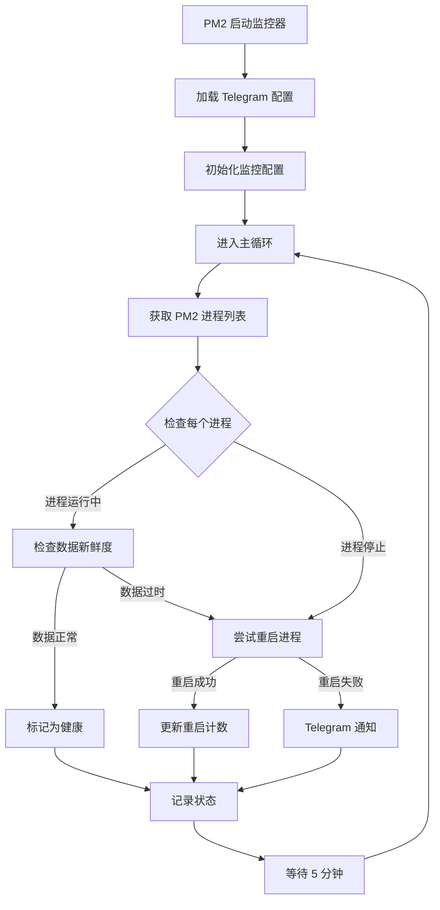

# 系统健康监控系统完整说明

## 📋 目录
- [系统概述](#系统概述)
- [系统架构](#系统架构)
- [运行逻辑与流程](#运行逻辑与流程)
- [数据存储格式](#数据存储格式)
- [核心功能](#核心功能)
- [监控的系统列表](#监控的系统列表)
- [技术依赖](#技术依赖)
- [API 接口](#api-接口)
- [配置说明](#配置说明)
- [故障排除](#故障排除)

---

## 系统概述

**系统健康监控系统 V2.0** 是一个全自动化的监控平台，负责监控所有数据采集器（PM2 进程）的运行状态和数据新鲜度，并在发现问题时自动尝试修复。如果无法自动修复，系统会通过 Telegram 发送通知。

### 核心特性
- ✅ **全面监控**：监控 17 个 PM2 进程状态
- ✅ **数据新鲜度检查**：检测数据采集延迟
- ✅ **自动修复**：自动重启异常进程（最多 3 次）
- ✅ **Telegram 通知**：无法修复时发送警报
- ✅ **实时仪表板**：Web UI 显示系统健康状态
- ✅ **详细日志**：记录所有监控和修复操作

---

## 系统架构

```
┌─────────────────────────────────────────────────────────────┐
│                     Flask Web 应用                           │
│                   (端口 9002)                                 │
│                                                               │
│  ┌──────────────┐  ┌──────────────┐  ┌──────────────┐      │
│  │ Web UI       │  │ API 路由     │  │ 静态资源     │      │
│  │ /data-health │  │ /api/*       │  │ /static/*    │      │
│  └──────────────┘  └──────────────┘  └──────────────┘      │
└───────────────────────────┬─────────────────────────────────┘
                            │
            ┌───────────────┴───────────────┐
            ▼                               ▼
┌─────────────────────┐         ┌─────────────────────┐
│  system-health-     │         │  数据采集器 (16个)  │
│  monitor-v2         │◄────────┤  PM2 进程           │
│  (Python 监控器)    │  监控   │                     │
└──────────┬──────────┘         └─────────────────────┘
           │
           ├─► PM2 状态检查 (pm2 jlist)
           ├─► 数据文件新鲜度检查
           ├─► 自动重启异常进程
           └─► Telegram 通知
```

### 组件说明

1. **Flask Web 应用** (`app.py`, port 9002)
   - 提供 Web UI 和 API 接口
   - 读取监控状态 JSON 文件
   - 提供手动重启接口

2. **健康监控器** (`system_health_monitor_v2.py`)
   - 每 5 分钟自动运行一次
   - 检查所有采集器状态
   - 自动重启异常进程
   - 记录日志并发送通知

3. **数据采集器** (16 个 PM2 进程)
   - 定时采集各类数据
   - 写入 JSONL 文件
   - 独立运行，互不影响

---

## 运行逻辑与流程

### 1. 启动流程



### 2. 监控检查流程

每 5 分钟执行一次完整检查：

```
第 1 步：获取所有 PM2 进程状态
  └─ 执行命令：pm2 jlist
  └─ 解析 JSON 输出

第 2 步：检查每个采集器
  ├─ 检查进程状态（online/stopped/errored）
  ├─ 检查数据文件是否存在
  ├─ 检查数据文件修改时间
  └─ 计算数据延迟时间

第 3 步：判断健康状态
  ├─ 进程状态 = online
  ├─ 数据延迟 < 阈值
  └─ 标记为 ✅ 健康 或 ❌ 异常

第 4 步：自动修复
  ├─ 异常进程重启次数 < 3
  ├─ 执行：pm2 restart <进程名>
  └─ 记录重启次数

第 5 步：发送通知
  ├─ 检测无法修复的问题
  ├─ 发送 Telegram 通知
  └─ 记录日志

第 6 步：保存状态
  ├─ 写入 data_health_monitor_state.json
  └─ 写入日志文件
```

### 3. 数据新鲜度检查逻辑

```python
def check_data_freshness(data_path, max_delay_minutes):
    """
    检查步骤：
    1. 查找数据目录中最新的 JSONL 文件
    2. 读取文件的修改时间（mtime）
    3. 计算当前时间与修改时间的差值
    4. 判断延迟是否超过阈值
    
    示例：
    - 文件修改时间：2026-02-15 14:50:00
    - 当前时间：2026-02-15 15:05:00
    - 延迟时间：15 分钟
    - 阈值：10 分钟
    - 结果：数据过时 ❌
    """
```

---

## 数据存储格式

### 1. 监控状态文件 (`data_health_monitor_state.json`)

**位置**: `/home/user/webapp/data/data_health_monitor_state.json`

**格式**:
```json
{
  "timestamp": 1771139400.123,
  "beijing_time": "2026-02-15 15:10:00",
  "total_monitors": 17,
  "healthy_count": 15,
  "unhealthy_count": 2,
  "today_restart_count": 5,
  "monitors": [
    {
      "name": "signal-collector",
      "status": "online",
      "data_status": "healthy",
      "last_data_time": "2026-02-15 15:08:23",
      "data_delay_minutes": 1.6,
      "restart_count": 0,
      "threshold_minutes": 10
    },
    {
      "name": "price-position-collector",
      "status": "online",
      "data_status": "stale",
      "last_data_time": "2026-02-15 14:50:00",
      "data_delay_minutes": 20.0,
      "restart_count": 2,
      "threshold_minutes": 10
    }
  ]
}
```

**字段说明**:
| 字段 | 类型 | 说明 |
|------|------|------|
| `timestamp` | float | Unix 时间戳（秒） |
| `beijing_time` | string | 北京时间字符串 |
| `total_monitors` | int | 监控的总系统数 |
| `healthy_count` | int | 健康系统数量 |
| `unhealthy_count` | int | 异常系统数量 |
| `today_restart_count` | int | 今日重启次数 |
| `monitors[].name` | string | PM2 进程名称 |
| `monitors[].status` | string | 进程状态 (online/stopped/errored) |
| `monitors[].data_status` | string | 数据状态 (healthy/stale/no_data) |
| `monitors[].last_data_time` | string | 最后数据时间 |
| `monitors[].data_delay_minutes` | float | 数据延迟分钟数 |
| `monitors[].restart_count` | int | 重启次数 |
| `monitors[].threshold_minutes` | int | 延迟阈值 |

### 2. 监控日志文件 (`logs/data_health_monitor.log`)

**位置**: `/home/user/webapp/logs/data_health_monitor.log`

**格式** (每行一条日志):
```
2026-02-15 15:10:00 - INFO - 开始健康检查...
2026-02-15 15:10:01 - INFO - 检查进程: signal-collector
2026-02-15 15:10:01 - INFO - ✅ signal-collector: 状态 online, 数据延迟 1.6 分钟
2026-02-15 15:10:02 - WARNING - ⚠️ price-position-collector: 数据延迟 20.0 分钟，超过阈值 10 分钟
2026-02-15 15:10:02 - INFO - 正在重启 price-position-collector...
2026-02-15 15:10:03 - INFO - ✅ 重启成功: price-position-collector
2026-02-15 15:10:04 - ERROR - ❌ sar-slope-collector 重启失败 3 次，发送 Telegram 通知
2026-02-15 15:10:04 - INFO - 健康检查完成：17 个系统，15 健康，2 异常
```

### 3. 采集器数据文件格式

所有采集器使用 **JSONL (JSON Lines)** 格式存储数据。

#### JSONL 格式特点：
- ✅ 每行一个独立的 JSON 对象
- ✅ 顺序写入，不需要修改已有数据
- ✅ 单行损坏不影响其他数据
- ✅ 支持流式处理和追加写入
- ✅ 易于解析和分析

#### 示例 1: 信号时间线 (`data/signal_timeline/*.jsonl`)
```jsonl
{"timestamp":1771139400.123,"beijing_time":"2026-02-15 15:10:00","symbol":"BTC","signal":"buy","price":50000.5,"reason":"突破阻力位"}
{"timestamp":1771139460.456,"beijing_time":"2026-02-15 15:11:00","symbol":"ETH","signal":"sell","price":3000.2,"reason":"跌破支撑位"}
```

#### 示例 2: 价格位置 (`data/price_position_10m/*.jsonl`)
```jsonl
{"timestamp":1771139400,"datetime":"2026-02-15 15:10:00","symbol":"BTC","position":"上轨","distance_percent":5.2,"amplitude":8.5}
{"timestamp":1771139400,"datetime":"2026-02-15 15:10:00","symbol":"ETH","position":"中轨","distance_percent":0.5,"amplitude":6.8}
```

#### 示例 3: SAR 斜率 (`data/sar_slope_jsonl/latest_sar_slope.jsonl`)
```jsonl
{"symbol":"BTC","timestamp":1771139400,"beijing_time":"2026-02-15 15:10:00","close":50000.5,"sar":49500.2,"position":"above","quadrant":"Q1","duration_minutes":45,"slope_value":0.25,"slope_direction":"up","sar_diff_abs":500.3,"sar_diff_pct":1.01}
```

---

## 核心功能

### 1. 实时监控 🔍

- **PM2 进程状态监控**
  - 检测进程是否在线（online/stopped/errored）
  - 监控 CPU 和内存使用情况
  - 检测进程重启次数

- **数据新鲜度监控**
  - 检查 JSONL 文件最后修改时间
  - 计算数据延迟时间
  - 与预设阈值对比

### 2. 自动修复 🔧

- **智能重启策略**
  ```
  第 1 次重启：立即重启
  第 2 次重启：等待 30 秒后重启
  第 3 次重启：等待 60 秒后重启
  第 4 次：放弃并发送通知
  ```

- **重启计数器**
  - 每个进程独立计数
  - 每天 0 点重置计数器
  - 防止无限重启循环

### 3. Telegram 通知 📢

发送通知的情况：
- ❌ 进程重启失败 3 次
- ❌ 数据持续过时超过 1 小时
- ❌ 数据文件丢失或损坏
- ❌ PM2 进程列表获取失败

通知消息格式：
```
🚨 系统健康监控警报

时间：2026-02-15 15:10:00
系统：price-position-collector
状态：重启失败 3 次
数据延迟：20.0 分钟（阈值 10 分钟）

请立即检查系统！
```

### 4. Web 仪表板 📊

- **概览卡片**
  - 总系统数
  - 健康系统数
  - 异常系统数
  - 今日重启次数

- **监控卡片**（每个系统一张）
  - 系统名称和状态图标
  - 进程状态（运行中/已停止）
  - 数据延迟时间
  - 最后数据时间
  - 重启次数
  - 手动重启按钮

- **实时更新**
  - 每 30 秒自动刷新
  - 平滑动画过渡
  - 状态颜色编码

---

## 监控的系统列表

| 序号 | 系统名称 | PM2 进程名 | 数据目录 | 延迟阈值 | 采集频率 |
|------|---------|-----------|---------|---------|---------|
| 1 | 信号时间线 | `signal-collector` | `data/signal_timeline/*.jsonl` | 10 分钟 | 5 分钟 |
| 2 | 价格位置追踪 | `price-position-collector` | `data/price_position_10m/*.jsonl` | 10 分钟 | 10 分钟 |
| 3 | 价格涨速监控 | `price-speed-collector` | `data/price_speed_10m/*.jsonl` | 5 分钟 | 5 分钟 |
| 4 | SAR斜率分析 | `sar-slope-collector` | `data/sar_slope_jsonl/*.jsonl` | 10 分钟 | 5 分钟 |
| 5 | SAR偏向统计 | `sar-bias-stats-collector` | `data/sar_bias_stats/*.jsonl` | 10 分钟 | 5 分钟 |
| 6 | 1小时爆仓金额 | `liquidation-1h-collector` | `data/liquidation_1h/*.jsonl` | 120 分钟 | 60 分钟 |
| 7 | OKX日涨跌幅 | `okx-day-change-collector` | `data/okx_day_change/*.jsonl` | 1500 分钟 | 1440 分钟 |
| 8 | 恐慌清洗指数 | `panic-wash-collector` | `data/panic_wash/*.jsonl` | 10 分钟 | 5 分钟 |
| 9 | 27币涨跌幅追踪 | `coin-change-tracker` | `data/coin_changes/*.jsonl` | 10 分钟 | 5 分钟 |
| 10 | 加密指数采集 | `crypto-index-collector` | `data/crypto_index/*.jsonl` | 10 分钟 | 10 分钟 |
| 11 | OKX交易历史 | `okx-trade-history-collector` | `data/okx_trade_history/*.jsonl` | 10 分钟 | 5 分钟 |
| 12 | OKX交易标记 | `okx-trading-marks-collector` | `data/okx_trading_marks/*.jsonl` | 10 分钟 | 5 分钟 |
| 13 | 爆仓警报监控 | `liquidation-alert-monitor` | `data/liquidation_alerts/*.jsonl` | 10 分钟 | 5 分钟 |
| 14 | 价格基线采集 | `price-baseline-collector` | `data/price_baselines/*.jsonl` | 1500 分钟 | 1440 分钟 |
| 15 | Google Drive管理 | `gdrive-jsonl-manager` | `data/dashboard_jsonl/*.jsonl` | 30 分钟 | 15 分钟 |
| 16 | 仪表板数据管理 | `dashboard-jsonl-manager` | `data/dashboard_jsonl/*.jsonl` | 30 分钟 | 15 分钟 |
| 17 | Flask Web应用 | `flask-app` | - | - | 持续运行 |

### 延迟阈值说明
- **5-10 分钟**：实时数据采集器（如价格、信号）
- **120 分钟**：小时级数据采集器（如爆仓数据）
- **1500 分钟（25 小时）**：日级数据采集器（如日涨跌幅）

---

## 技术依赖

### PM2 进程管理

所有采集器均由 PM2 管理：

```bash
# 查看所有进程
pm2 list

# 查看日志
pm2 logs system-health-monitor-v2

# 重启监控器
pm2 restart system-health-monitor-v2

# 停止监控器
pm2 stop system-health-monitor-v2

# 删除进程
pm2 delete system-health-monitor-v2
```

### Python 依赖包

**核心依赖** (`requirements.txt`):
```
Flask>=2.3.0           # Web 框架
flask-cors>=4.0.0      # 跨域支持
requests>=2.28.0       # HTTP 请求
pytz>=2023.3           # 时区处理
numpy>=1.21.0          # 数值计算（部分采集器使用）
```

**安装命令**:
```bash
cd /home/user/webapp
pip3 install -r requirements.txt
```

### Node.js 依赖包

**核心依赖**:
```json
{
  "pm2": ">=5.3.0"
}
```

**安装命令**:
```bash
npm install -g pm2
```

### 系统环境变量

**必需变量**:
```bash
# Python 环境
export PYTHONPATH="/home/user/webapp:$PYTHONPATH"

# 时区设置
export TZ="Asia/Shanghai"
```

**可选变量** (Telegram 通知):
```bash
# 在 config/telegram_config.py 中配置
TELEGRAM_BOT_TOKEN="your_bot_token_here"
TELEGRAM_CHAT_ID="your_chat_id_here"
```

---

## API 接口

### 1. 获取监控状态

**接口**: `GET /api/data-health-monitor/status`

**描述**: 获取所有系统的实时健康状态

**响应示例**:
```json
{
  "success": true,
  "timestamp": 1771139400.123,
  "beijing_time": "2026-02-15 15:10:00",
  "summary": {
    "total": 17,
    "healthy": 15,
    "unhealthy": 2,
    "today_restart_count": 5
  },
  "monitors": [
    {
      "name": "signal-collector",
      "display_name": "信号时间线",
      "status": "online",
      "data_status": "healthy",
      "last_data_time": "2026-02-15 15:08:23",
      "data_delay_minutes": 1.6,
      "restart_count": 0,
      "threshold_minutes": 10
    }
  ]
}
```

### 2. 获取监控日志

**接口**: `GET /api/data-health-monitor/logs?limit=50`

**参数**:
- `limit` (可选): 返回的日志行数，默认 50

**响应示例**:
```json
{
  "success": true,
  "logs": [
    "2026-02-15 15:10:00 - INFO - 开始健康检查...",
    "2026-02-15 15:10:01 - INFO - ✅ signal-collector: 健康"
  ],
  "total_lines": 2
}
```

### 3. 手动重启进程

**接口**: `POST /api/data-health-monitor/restart`

**请求体**:
```json
{
  "pm2_name": "signal-collector"
}
```

**响应示例**:
```json
{
  "success": true,
  "message": "进程 signal-collector 重启成功",
  "timestamp": 1771139400.123
}
```

### 4. 获取进程日志

**接口**: `GET /api/data-health-monitor/service-logs?service=signal-collector&lines=20`

**参数**:
- `service` (必需): PM2 进程名
- `lines` (可选): 返回的日志行数，默认 20

**响应示例**:
```json
{
  "success": true,
  "service": "signal-collector",
  "logs": [
    "2026-02-15 15:10:00 - 开始采集信号数据...",
    "2026-02-15 15:10:05 - 采集完成，保存 29 条数据"
  ]
}
```

---

## 配置说明

### 1. 监控配置 (`system_health_monitor_v2.py`)

**添加新的监控系统**:
```python
MONITOR_CONFIG = {
    # 进程名: (数据文件路径, 最大允许延迟分钟数)
    'new-collector': ('data/new_data/*.jsonl', 10),
}
```

**修改延迟阈值**:
```python
# 将 signal-collector 的阈值从 10 分钟改为 15 分钟
'signal-collector': ('data/signal_timeline/*.jsonl', 15),
```

### 2. Telegram 配置 (`config/telegram_config.py`)

**创建配置文件**:
```bash
cd /home/user/webapp
mkdir -p config
cat > config/telegram_config.py << 'EOF'
# Telegram 机器人配置
TELEGRAM_BOT_TOKEN = "your_bot_token_here"
TELEGRAM_CHAT_ID = "your_chat_id_here"
EOF
```

**获取 Bot Token**:
1. 在 Telegram 中搜索 `@BotFather`
2. 发送 `/newbot` 创建新机器人
3. 按提示设置名称和用户名
4. 获取 Token

**获取 Chat ID**:
1. 搜索 `@userinfobot`
2. 发送任意消息
3. 机器人会返回你的 Chat ID

### 3. PM2 配置

**启动监控器**:
```bash
cd /home/user/webapp
pm2 start source_code/system_health_monitor_v2.py \
  --name system-health-monitor-v2 \
  --interpreter python3 \
  --cron "*/5 * * * *"  # 每 5 分钟运行一次
```

**保存 PM2 配置**:
```bash
pm2 save
pm2 startup
```

---

## 故障排除

### 问题 1: 监控器无法启动

**症状**: PM2 显示 `errored` 状态

**解决方法**:
```bash
# 查看错误日志
pm2 logs system-health-monitor-v2 --err --lines 50

# 检查 Python 依赖
pip3 list | grep -E "Flask|requests|pytz"

# 检查文件权限
ls -la /home/user/webapp/source_code/system_health_monitor_v2.py

# 手动运行测试
cd /home/user/webapp
python3 source_code/system_health_monitor_v2.py
```

### 问题 2: 数据显示为"无数据"

**症状**: Web UI 显示采集器状态为"无数据"

**解决方法**:
```bash
# 检查数据目录是否存在
ls -la /home/user/webapp/data/signal_timeline/

# 检查采集器是否运行
pm2 list | grep signal-collector

# 查看采集器日志
pm2 logs signal-collector --lines 50

# 手动重启采集器
pm2 restart signal-collector
```

### 问题 3: Telegram 通知不发送

**症状**: 监控器检测到问题但没有收到通知

**解决方法**:
```bash
# 检查配置文件
cat /home/user/webapp/config/telegram_config.py

# 测试 Telegram 连接
python3 << 'EOF'
from config.telegram_config import TELEGRAM_BOT_TOKEN, TELEGRAM_CHAT_ID
import requests

url = f"https://api.telegram.org/bot{TELEGRAM_BOT_TOKEN}/sendMessage"
data = {"chat_id": TELEGRAM_CHAT_ID, "text": "测试消息"}
response = requests.post(url, json=data)
print(response.json())
EOF
```

### 问题 4: 进程频繁重启

**症状**: 采集器不断重启，日志显示大量重启记录

**解决方法**:
```bash
# 检查采集器脚本是否有错误
pm2 logs signal-collector --err --lines 100

# 检查系统资源
free -h  # 内存
df -h    # 磁盘空间

# 检查 Python 进程
ps aux | grep python3

# 增加延迟阈值（临时解决）
# 编辑 system_health_monitor_v2.py
# 'signal-collector': ('data/signal_timeline/*.jsonl', 20),  # 改为 20 分钟
```

### 问题 5: Web UI 不更新

**症状**: 页面显示的数据不刷新

**解决方法**:
```bash
# 检查 Flask 应用是否运行
pm2 list | grep flask-app

# 重启 Flask 应用
pm2 restart flask-app

# 检查状态文件
cat /home/user/webapp/data/data_health_monitor_state.json

# 清除浏览器缓存
# 按 Ctrl+Shift+R (Windows/Linux) 或 Cmd+Shift+R (Mac)
```

---

## 常用命令速查

### PM2 管理
```bash
# 查看所有进程
pm2 list

# 查看监控器状态
pm2 status system-health-monitor-v2

# 实时日志
pm2 logs system-health-monitor-v2

# 历史日志（不阻塞）
pm2 logs system-health-monitor-v2 --nostream --lines 50

# 重启监控器
pm2 restart system-health-monitor-v2

# 停止监控器
pm2 stop system-health-monitor-v2

# 删除监控器
pm2 delete system-health-monitor-v2

# 保存配置
pm2 save

# 重启所有进程
pm2 restart all
```

### 数据检查
```bash
# 查看最新数据
tail -5 /home/user/webapp/data/signal_timeline/*.jsonl

# 统计数据行数
wc -l /home/user/webapp/data/signal_timeline/*.jsonl

# 查看数据文件修改时间
ls -lht /home/user/webapp/data/signal_timeline/

# 检查数据完整性
jq . /home/user/webapp/data/signal_timeline/*.jsonl | head -20
```

### 日志查看
```bash
# 监控器日志
tail -f /home/user/webapp/logs/data_health_monitor.log

# 特定采集器日志
pm2 logs signal-collector --lines 50

# 错误日志
pm2 logs signal-collector --err --lines 50

# 查找错误
grep -i error /home/user/webapp/logs/data_health_monitor.log
```

---

## 更新历史

### V2.0.0 (2026-02-15)
- ✅ 全面重构监控系统
- ✅ 添加自动修复功能
- ✅ 集成 Telegram 通知
- ✅ 优化 Web UI 界面
- ✅ 添加详细日志记录
- ✅ 移除已废弃的监控项

### V1.0.0 (2025-12-01)
- ✅ 初始版本发布
- ✅ 基础监控功能
- ✅ 简单的 Web UI

---

## 联系支持

如有问题，请检查：
1. 📋 本文档的故障排除章节
2. 📊 监控日志文件
3. 🔍 采集器日志（PM2 logs）
4. 💬 Telegram 通知消息

系统设计：Claude Code Agent  
文档版本：V2.0.0  
最后更新：2026-02-15
